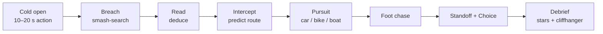

# COLD READ — Game Design & Full Storyboard

2026-09-18 · @Someone

## What changes from the Gemini draft

Keep the bones: the rank ladder, breach → predict → chase, brick-voxel art, checkpoints and gem revives. Fix five things that would sink it.

1. **The hook got lost.** The unique idea was *predicting the criminal*. By the end of that thread it had become a brick cop chase game with a 5-second swipe. A brick cop game already exists: LEGO City Undercover, LEGO's own (2013, remastered 2017). Fix: deduction stays, but fast. How well you read the evidence decides where the chase starts. Brain feeds brawn.
2. **30-minute levels.** Mobile sessions last a few minutes (see Hooks). Fix: a *case* can run 30 minutes; a *scene* never runs past 5, and the game saves between scenes.
3. **Choices broke your own rule.** You said choices change the story, not success. Gemini's example (hostage hurt → funding cut → next level harder) changes difficulty. Fix: choices change who is with you, what people say, how the city looks and the ending. Never difficulty. If a squad member leaves, a stand-in with the same ability fills the slot.
4. **Lego.** We can't use the name, the minifigure shape (a registered EU trade mark, upheld in 2023) or "Master Builder" (a LEGO Movie term Gemini used for the villain). Brick-voxel as a style is fine; we design our own figure.
5. **"Fable can finish this tonight."** It can write the code, level data and dialogue fast. It cannot make the 3D assets, tune how the chase feels, record audio or playtest. Act 1 can reach players in about a month; the full story ships as episodes over about three (see Build plan).

Also replaced: "The Architect" (a Matrix-era cliché with a generic plan). The new villain is built out of the core mechanic, so the twist lands on the player personally.

## Pitch

**COLD READ** (working title) is a brick-voxel detective action game for phones. You smash crime scenes apart for evidence, read it in seconds, predict where the suspect will run, then cut them off in a chase that wrecks the city. Over ten cases the mastermind is studying *you*, and in the final act she uses your own habits against you.

Store line: *Read the evidence. Predict the run. Wreck the getaway.*

### Pillars

- **Think fast, not long.** Every thinking moment lasts 10–30 seconds and always moves forward. A weak read makes the chase harder; it never stops the game.
- **Everything breaks.** Scenes are built from bricks. Smashing is how you search.
- **The city remembers.** Choices change people, places and the ending. Never difficulty.
- **The criminal learns you.** The villain's route AI adapts to how you play, and Act 3 says your patterns out loud.

### Familiar vs new

| Part | Familiar from | What's new |
| --- | --- | --- |
| Timed scene search with star score | Criminal Case | 3D and destructible; smashing is searching |
| Foot chases | Subway Surfers-style lane runners | A tackle meter; the route depends on your prediction |
| Car chases with takedowns | Smash Cops, Need for Speed pursuits | Your roadblocks set the start; brick debris everywhere |
| Timed choices, "they'll remember that" | Telltale games | End-of-case stats; the villain quotes your choices back |
| Chunky voxel look | Crossy Road, brick games | Our own figures; a West African coastal megacity |
| Score | Cop-show synths | An Afrobeats-built score that reacts to the chase |

## What hooks players

Players decide in the first minute and then play in 3–5 minute bursts, many times a day. Everything below is designed around that.

| Finding | Evidence | What we do |
| --- | --- | --- |
| Sessions are short | Median mobile session 3.1–3.5 min in 2025; top 25% \~5.2 min; top 10% just over 8 min. Africa's median is 2.69 min but with 5.48 sessions a day, the most of any region ([GameAnalytics 2026](https://investgame.net/wp-content/uploads/2026/01/2026-01-27-2026-mobile-pc-benchmarks_compressed.pdf)) | Scenes of 1–5 min. Auto-save after every scene. A long case spans several sittings |
| Retention is brutal | Median D1 \~22%, top 25% just above 30%, top 10% \~40%. Median D7 just under 4%, top 25% 6–7% (same report) | The first session gets more design time than any single case |
| The first minute decides | Core gameplay within 60 s, the "this is fun" moment within 90 s; defer accounts, permissions and settings ([Playio](https://blog.playio.co/mobile-game-onboarding-retention)) | No menu on first launch. The game opens mid-chase |
| Winners run three loops | One loop fits a session, one spans a day's sessions, one spans weeks (expert advice in the GameAnalytics report) | Scene (minutes) → case (a day) → rank ladder, Street Calls and the villain arc (weeks) |
| Detective hits are serialized | [Criminal Case](<https://en.wikipedia.org/wiki/Criminal_Case_(video_game)>): timed scene search, 1M daily players two months after launch, 100M users within about a year; its success is credited partly to meaningful narratives. [Duskwood](https://apps.apple.com/us/app/duskwood-detective-story/id1479430106) shipped as ten episodes, and players compare it to a TV show | Every case ends on a cliffhanger. All ten cases are one conspiracy |
| Rewarded ads work — until they don't | Opt-in, completion above 90% ([Coinis, citing AppLovin](https://coinis.com/glossary/rewarded-video)). Choices raised daily ads from 3 to 100 and revenue per monthly player fell 30%; they tested cutting to 10 ([Pixelberry](https://www.pixelberrystudios.com/blog/2024/7/2/upcoming-tests-in-choices)) | Rewarded ads only in story; about 8 a day, cap tuned in soft launch |
| Paid "better choices" earn but annoy | Choices sells premium options, e.g. a free short sword vs. a paid double-ended blade; critics say it railroads non-payers into worse choices ([Wikipedia](https://en.wikipedia.org/wiki/Choices:_Stories_You_Play)) | We don't. Gems buy bonus scenes and looks, never better outcomes |

### Hooks built into every case

- **Cold open in motion.** Every case starts inside action, then rewinds to the scene.
- **Juice.** Hit-stop on every smash, screen shake on rams, haptics on takedowns, a music stinger on every evidence find.
- **Variable reward.** Evidence hides inside random smashable objects, so every smash might pay.
- **Visible mastery.** 1–3 stars per scene (speed, evidence found, clean takedown). Replays chase stars.
- **Social mirror.** After each choice: "38% of detectives did the same."
- **The Mirror.** From Case 8, the villain predicts *your* habits and says so. Nobody else's game does this to them.

## Structure

Ten ranks, ten story cases, about 2.6 hours of story on a first run. Cases grow from 4 to 30 minutes; no scene runs past 5. Street Calls give endless short replay between cases.

| Case | Rank earned | Length | Scenes | New in this case |
| --- | --- | --- | --- | --- |
| 1 Snatch | Rookie | 4 min | 5 | Foot chase, Breach, Read, car chase |
| 2 Red Light | Constable | 6 min | 5 | Intercept map; Patch joins (TRACE) |
| 3 The Workshop | Detective | 9 min | 6 | Juno joins (EYE drone); planted decoy evidence |
| 4 Container 9 | Detective Sergeant | 11 min | 6 | Boat chase; Sol joins (RAM) |
| 5 Convoy | Inspector | 14 min | 7 | Wren joins (HOLD); Standoff scenes |
| 6 Lift | Senior Inspector | 16 min | 7 | Rooftop chase; opening-bridge set piece |
| 7 The Leak | Chief Inspector | 19 min | 8 | False-flag Intercept (bait your own map) |
| 8 Blackout | Superintendent | 22 min | 8 | The Mirror; unlit-city driving |
| 9 Three Bridges | Chief Superintendent | 25 min | 9 | Split squad across three pursuits |
| 10 Cold Read | Commander | 30 min | 10 | Final boss run, helicopter takedown |

### Progression rules

- **Cases 1–4 open back to back.** No gates while the hook is setting.
- **From Case 5, a star gate.** The next case needs a star total that about 80% of players already have. The rest need one or two Street Calls (\~5 min). No wait timers.
- **Promotion after every case.** A short ceremony, a new squad member or ability, one free cosmetic.
- **Choices lock on first play.** After the finale, *Case Rewind* lets players replay any case and take the other path.
- **Two currencies only.** Coins (earned) and Gems (bought, plus a small daily trickle).

### Street Calls (the daily loop)

Procedurally assembled 2–4 minute jobs built from the same scene templates, set in districts you've unlocked.

- Crime types: bag snatch, shop robbery, hit-and-run, smuggling run, stolen car.
- One daily **Hot Call** with a modifier: rain, night, no roadblocks, double evidence.
- One weekly **Most Wanted** boss call with a unique getaway vehicle.
- Rewards: coins, stars, cosmetic parts, badge progress. Never power.

### The three loops

1. **Minutes:** one scene — smash, read, chase, stars.
2. **A day:** one case over a few sittings, ending on a cliffhanger.
3. **Weeks:** rank ladder, Street Call streaks, the villain slowly learning you.

## Core loop

Every case is a chain of the same seven scene types. How well you search and read decides how hard the chase is; nothing you think about ever blocks progress.



Bigger cases repeat the Breach → Read → Intercept → Pursuit block two to four times before the Standoff.

| Scene | Length | Controls | Score | If you fail |
| --- | --- | --- | --- | --- |
| Breach | 45–90 s | Tap or drag to smash; tap evidence to bag it | Time left, % evidence, the hidden Tell | Timer ends: you keep what you found |
| Read | 10–30 s | Drag evidence cards into 2–3 theory slots | Solid / Shaky / Cold | Never fails; a weak read makes the chase harder |
| Intercept | 10–20 s | Drag 1–3 roadblocks onto a top-down route map | Cut off / Missed | Missed = normal chase start |
| Pursuit | 60–180 s | Auto-drive; swipe to switch lanes or drift, tap to ram, hold for ability | Takedown time, near-misses | Suspect escapes: restart from checkpoint (revive offer) |
| Foot chase | 30–90 s | Lane runner: swipe up, down, left, right | Tackle speed | Same as Pursuit |
| Standoff | 3–8 s | Slow motion; tap the right target | Clean / Messy | Messy outcome, story continues |
| Choice | 6 s | Swipe left or right | None — stats only | Timer runs out = Hesitate, a third outcome |

### How the thinking stays fast

**Read.** The slots are always a sentence: "The next target is **\_\_\_** because of **\_\_\_** and **\_\_\_**." Players drag evidence cards into the blanks.

- **Solid** (all right): the Pursuit starts on the suspect's bumper.
- **Shaky** (one wrong): starts mid-distance.
- **Cold** (mostly wrong): starts far back and the suspect has an escort car.

From Case 3, criminals plant decoys. Each decoy has a visual tell an attentive player can spot: a receipt dated tomorrow, paint still wet, a left-hand glove on a right-handed suspect. Patch's TRACE marks decoys for players who miss them.

**Intercept.** The map shows 2–5 possible escape routes. Line thickness shows how likely each is, weighted by the evidence you bagged. You place roadblocks. The suspect's route is a weighted random pick; block it and the chase starts with them forced into a detour. From Case 8 the weights also lean away from where *you* usually block (see The Mirror under World and cast).

### Squad abilities

One charge per scene, refilled between scenes.

| Member | Joins | Ability | Where it works |
| --- | --- | --- | --- |
| Dash | Case 1 | NITRO — speed burst | Pursuit |
| Patch | Case 2 | TRACE — pulse reveals hidden evidence and marks decoys | Breach, Read |
| Juno | Case 3 | EYE — drone confirms one route; hacks one traffic light | Intercept, Pursuit |
| Sol | Case 4 | RAM — smash through walls and roadblocks | Breach, Pursuit |
| Wren | Case 5 | HOLD — +4 s in a Standoff; clears a crowd in a foot chase | Standoff, Foot chase |

If a story choice removes a member, a stand-in with the same ability fills the slot for those cases. Different voice and jokes, identical power. Choices never change difficulty.

### Difficulty curve by rank

- More routes on the Intercept map, fewer roadblocks per route.
- More decoys per Read, with subtler tells.
- Faster getaway vehicles, escort cars, armored trucks from Case 4.
- Longer chains of scenes before a checkpoint (never more than two scenes).

### Tone rule

No blood and no killing. Suspects are tackled and cuffed; the player shoots tires, locks and drones, not people. Brick civilians dive clear and are never hurt. This keeps the store age rating lower, widens the audience and opens more ad demand.

## World and cast

The game is set in **Lagoon City** (working name), a fictional West African coastal megacity of islands, markets and long bridges. No other cop-chase game looks like this, and it fits a score built on Afrobeats.

### Districts

| District | Look | Gameplay it gives | First case |
| --- | --- | --- | --- |
| Market Mile | Open-air market, tight lanes, yellow minibuses, bike taxis | Weaving foot chases, stall destruction | 1 |
| The Stacks | Tower blocks, stairwells, laundry lines | Rooftop routes, vertical breaches | 2 |
| Portside | Docks, container stacks, cranes, the lagoon | Boat chases, container mazes | 3 |
| Goldline Island | Glass finance towers, the Sightline tower | Vault breaches, elevated roads | 5 |
| The Three Bridges | Two long road bridges and one lift bridge | The city's chokepoints for every Intercept | 6 |
| Skyway | Elevated ring road | High-speed pursuits, jumps between levels | 5 |
| Hillcrest | Walled estates on the hills | Stealthier breaches, winding descents | 7 |

### The unit

**INTERCEPT** is a new fast-response investigation unit, under a civilian oversight board, built to catch crews that move faster than the regular force. You are **ROOK**, its newest detective. Rook is a callsign, so the player's look is fully customizable.

### Cast

| Character | Role | Hook |
| --- | --- | --- |
| Commander Ifeoma "Ife" Nwosu | Runs INTERCEPT | Principled, squeezed by politics; fights to keep the unit alive |
| Dash (Kojo Mensah) | Partner, driver | Jokes under fire; the player's first friend |
| Patch (Dr. Amara Okafor) | Forensics | Blunt and exact. Mole suspect in Case 7 |
| Juno (Juno Bello) | Hacker, drone pilot | Recruited out of trouble; installed the unit's software. Mole suspect in Case 7 |
| Sol (Solomon Eze) | Breacher | Gentle giant who loves demolition a bit too much |
| Wren (Wuraola Adeyemi) | Negotiator | Grew up on the same street as the Act 2 boss |
| Kemi Hart | Journalist, live-streamer | Ally or rival, depending on Case 1 |
| Commissioner Bayo Cole | City police chief | Signed the software deal; wants credit, fears blame |

### The villains

- **The Kites** (Act 1) — a bike-taxi kidnapping crew led by **Spool**. Fast, local, hired muscle.
- **Tollgate** (Act 2) — a smuggling syndicate behind a legitimate shipping firm, run by **Madam Kesh**. It "taxes" everything that crosses the port and the bridges.
- **The Cartographer** (Act 3) — the anonymous client both crews work for. They are paid in maps, never faces. She is **Ada Voss**, founder of Sightline, the city's favorite tech company. Sightline built the prediction software INTERCEPT uses. She hands it to the unit, smiling, in Case 1.

Ada's plan: break the city's movement — bridges, traffic, power — then offer Sightline to run all of it under emergency powers. Her belief, in one line: *"People aren't free. They're predictable."*

### The Mirror

From the first minute, the game quietly logs how you play:

- where you place roadblocks (bridges, back streets, highways) and how early;
- how you search (smash everything vs. precise);
- whether you Hesitate on choices, and which way you swipe;
- which squad abilities you lean on.

In Act 3, Ada's route AI leans away from your habits, capped so it stays beatable if you change your pattern. Her dialogue quotes your real numbers: *"You block the bridges first. Seven times out of ten."* After Case 8, a Mirror screen shows her profile of you. It's cheap to build (counters plus dialogue slots) and it's the most screenshot-able moment in the game.

### Setting note

A police-hero story in a Lagos-like city will be read against the 2020 #EndSARS protests. The story already answers that: INTERCEPT sits under civilian oversight, corruption inside the force is part of the plot, and the villain's pitch is surveillance policing. Handled honestly, it makes the story stronger.

## Choice system

One big choice per case (ten in total) plus two or three quick dialogue picks. Choices change people, places and the ending; they never touch difficulty, stars or rewards.

### What a choice can change

- **Who is with you** — squad presence, with same-power stand-ins.
- **What people say** — dialogue variants and a hidden Trust score (0–3) per squad member and Kemi.
- **How the city looks** — layer toggles: panic posters, curfew barriers, Kemi's billboards, Tollgate graffiti.
- **Which bonus scenes you see** — 20–40 second extra beats, not extra levels.
- **The ending** — three versions.

**Hesitate.** Let the 6-second timer run out and Rook freezes. Someone else decides, usually the worst compromise, and people remember that too.

### The ten big choices

| Case | The choice | Left | Right | Pays off in |
| --- | --- | --- | --- | --- |
| 1 | Kemi is live-streaming the snatch | Give her an exclusive | Seize her phone | Kemi ally or rival; city calm or panicked (Cases 2–10) |
| 2 | The Kites driver was coerced | Flip him as an informant | Book him | Case 3 entry point; informant's fate in the epilogue |
| 3 | Hostages or the stolen drive | Save all three hostages | Grab the drive | Keys partly recovered or lost; engineer retaken (Case 4 opener) |
| 4 | Commissioner orders you off Tollgate | Stand down, let Ife fight it | Raid anyway | Cole ally or hostile (Case 8) |
| 5 | Wren knows the gunman | Let Wren talk him down | Take the shot at his weapon | He becomes a source, or Wren's Trust drops |
| 6 | Lift bridge rising, bus stuck on the lip | Stop and steady the bus | Jump after the getaway | Public trust; you hold the vault drive or not |
| 7 | The unit has a leak | Suspend Patch | Suspend Juno | Who sits out Case 8; Trust (Hesitate = Ife suspends both) |
| 8 | Ada frames INTERCEPT on live TV | Expose Sightline now, half-proven | Go quiet, build proof | City splits, or turns on you (NPC barks, dressing) |
| 9 | Kesh offers the demolition schedule | Deal: she walks | Refuse: crack it yourselves | Same info either way; Kesh free or jailed in epilogue |
| 10 | Ada's offer on the roof | Code for her freedom | Arrest her, city stays dark | Ending A or B (C if unlocked) |

### Endings

| Ending | How you get it | What happens |
| --- | --- | --- |
| A · The Deal | Take the code | Power returns, INTERCEPT are heroes. Ada escapes by helicopter. Final text from an unknown number: your Mirror stats. Sequel hook |
| B · Dark City | Arrest Ada | Blackout lasts weeks. The epilogue shows the city running itself: market generators, volunteer traffic wardens. INTERCEPT rebuilds without Sightline |
| C · Cold Read | Three or more allies with you on the roof | A third option appears: Juno breaks the code live while Kemi streams Sightline's data to the world. Ada is arrested and power returns, but the leak also exposes INTERCEPT's own use of the software. The unit is suspended pending inquiry; Rook hands in the badge. Sequel hook |

Allies on the roof: Dash, Patch, Juno, Wren and Kemi. Each is there if their Trust is 2+ (Kemi: ally flag, or rebuilt Trust in Case 8).

### Flags (save data)

`kemi` (ally / rival) · `informant` (flipped / booked) · `keys` (partial / lost) · `cole` (ally / hostile) · `wren_source` (yes / no) · `public_trust` (−2…+2) · `vault_drive` (yes / no) · `suspended` (patch / juno / both) · `expose` (early / late) · `kesh` (free / jailed) · `trust_<name>` (0–3) · `mirror_*` counters · `ending` (A / B / C).

## Storyboard · Act 1 — The Kites

Act 1 is street-level and fast: three specialists vanish, each snatched by a bike-taxi crew that leaves a small red paper kite at every scene. It ends with the question that drives the game: who hired them, and what did they build?

### Case 1 · Snatch

*Rank earned: Rookie · \~4 min · Market Mile, dusk · first launch, no menu*

**Logline.** Bridge engineer Funmi Adeyinka is dragged off a bike taxi into a van. Rook and Dash are two stalls away.

1. **Cold open (0:00–0:15).** Black screen, market noise. The camera drops through the brick market at dusk. A van cuts off a bike taxi; masked Kites haul Funmi inside. Dash: *"Rook — go!"* The player is already running.
2. **Foot chase (0:15–1:00).** One gesture taught at a time with big on-screen arrows: lanes, then jump, then slide. It cannot be lost; the goon trips over a fruit stall at the end regardless. Tackle.
3. **Breach (1:00–1:30).** The goon's abandoned delivery cart, four smashables. Evidence: a burner phone (swipe to unlock, shows a pin at Skyway Exit 4), a bridge toll token stamped with a gate logo (seeds Tollgate), and a red paper kite. The phone runs Sightline Maps; nobody comments.
4. **Read (1:30–1:45).** One blank: *"The van is heading to \_\_\_."* Drag the phone. Solid.
5. **Pursuit (1:45–3:00).** Rook drives, Dash rides shotgun. Swipe through market traffic, ram the van three times until its panels shed bricks. Dash teaches NITRO: *"Hold it! Hold the button!"* The van spins out — empty. Funmi was switched to a bike mid-chase.
6. **Choice (3:00–3:30).** Kemi Hart is live-streaming ("12.4k watching"), phone in Rook's face. **Give her an exclusive** or **seize her phone.**
7. **Debrief (3:30–4:00).** Commander Ife: *"First day, and you lost the victim."* Cut to INTERCEPT's launch ceremony that night: Ada Voss hands the unit Sightline. *"It tells you where they're going before they know it themselves."* Last beat: the caught Kite, behind glass: *"You didn't lose her. You were shown where to look."* Title card: **COLD READ.**

Music: percussion only in the chase; full drop on the first ram; tape-stop into the choice.

### Case 2 · Red Light

*Rank earned: Constable · \~6 min · The Stacks, night*

**Logline.** Dayo Sanni, who writes the code for the city's traffic lights, vanishes from his tower flat. Every light on his street turned green at once.

1. **Cold open.** A junction where every light flips green. Brick cars pile into each other; drivers pop out, shaking fists. No one is hurt.
2. **Breach, Dayo's flat (60 s).** Patch joins and teaches TRACE: the pulse shows wet footprints leading up and a hard drive hidden in a speaker. Evidence: laptop with the traffic-control login still open, the footprints, a "Kites Express" delivery receipt, a red kite.
3. **Read.** *"They took him to \_\_\_ by \_\_\_."* Rooftop → Tower 3, by bike taxi.
4. **Foot chase, rooftops.** Laundry lines, satellite dishes, gaps between towers. The runner, Needle, hands Dayo to a bike convoy below.
5. **Intercept (tutorial).** The convoy splits three ways. Sightline glows one route as "most likely." It's right. The player learns to trust it. (It will betray them in Act 3.)
6. **Pursuit, bikes.** Weave through the Stacks' market street and take down the lead bike. Dayo is not on it. The rider is a middle-aged man, shaking. Spool holds his debts and his family's address.
7. **Choice.** **Flip him as an informant** or **book him.**
8. **Debrief.** The driver: *"No ransom. They're making them* build *something."* Cliffhanger: at Portside, a third kite drops on a dispatcher's desk.

Kemi variant: as ally, her appeal brings a 20-second bonus tip scene (a grandmother who saw the bikes). As rival, she reached the flat first, and Patch spends the Breach grumbling about contamination. Evidence is identical either way.

### Case 3 · The Workshop

*Rank earned: Detective · \~9 min · Portside, heavy rain · Act 1 finale*

**Logline.** Port dispatcher Tobi Lawal is gone. The trail leads to a workshop hidden inside a container stack, where all three specialists are being forced to work.

1. **Cold open.** Juno breaks into INTERCEPT's network live to prove it's leaky. Ife hires her on the spot. Juno: *"I installed your Sightline this morning. You're welcome."*
2. **Breach, dispatch office (75 s).** First planted decoy: a boarding pass for tonight's flight, printed with tomorrow's date. Real evidence: rust flakes matching container paint, a manifest listing Container 9 (seeds Case 4), a kite.
3. **Read, with decoys.** *"The hostages are at \_\_\_ because of \_\_\_ and \_\_\_."* Right: container stack, rust flakes, manifest. Wrong: the airport, via the boarding pass.
4. **Intercept.** Juno teaches EYE: the drone confirms one route. Target is Spool himself, driving between the yard and the workshop.
5. **Pursuit, container yard.** Cranes swing containers into your lane; one drops ahead and you drift under it as it lands.
6. **Breach, the Workshop (90 s).** Three hostages chained at workbenches. Whiteboards of bridge diagrams. A server wiping itself, the progress bar climbing.
7. **Choice.** **Save all three hostages** (the drive wipes) or **grab the drive** (a crane lifts Funmi's container away; she's recovered at the start of Case 4).
8. **Standoff.** Spool on a crane gantry with a remote. Shoot the remote out of his hand. He is cuffed.
9. **Debrief (Act 1 end).** The victims explain what they built, together called *the Keys*: every bridge's structural weak points (Funmi), a backdoor into traffic control (Dayo), and the port's customs blind spots (Tobi). Spool, in interrogation: *"Never saw the client. We got paid in maps."* He leans to the glass: *"The Cartographer says hello, Rook."* Title card: **ACT II — TOLLGATE.**

## Storyboard · Act 2 — Tollgate

Act 2 goes bigger and corporate: Tollgate uses the Keys for heists that each steal one piece of a larger plan, and the unit discovers its plans are leaking. It ends by revealing that the leak was never a person.

### Case 4 · Container 9

*Rank earned: Detective Sergeant · \~11 min · Portside and the lagoon, dawn*

**Logline.** Using Tobi's customs blind spots, Tollgate slips Container 9 out of the port. Inside: industrial demolition charges stolen from a construction firm.

1. **Cold open.** Sol joins by driving an armored van through a Tollgate warehouse wall. Variant: if Funmi was retaken in Case 3, she's inside and he carries her out; if not, he recovers the workshop's printouts. Same scene, different prop.
2. **Breach, Kesh Maritime office (75 s).** Ledger pages, container seal numbers, a gala photo of Madam Kesh with Commissioner Cole. Decoy: a seal number with one digit painted over.
3. **Choice (early).** Cole radios: stand down, Kesh Maritime is a city partner. **Stand down** (Ife gets a judge's warrant 30 seconds later and you go anyway, officially) or **raid anyway** (Cole's fury is on record).
4. **Read.** *"Container 9 leaves by \_\_\_ at \_\_\_."* Right: by barge at dawn (tide table + barge booking). Wrong: by truck on the Skyway.
5. **Intercept.** Four lagoon channels; your roadblocks are police boats.
6. **Pursuit, boats (new vehicle).** Speedboats through Stiltwater, a fictional stilt-house neighborhood: fishing nets, low walkways, barges. Ram the tug.
7. **Foot chase.** Across floating barges and container roofs as the tug drifts.
8. **Standoff.** The crew guarding Container 9. Shoot the door lock. Inside: half the charges, and a chalk note in Kesh's hand: *LIFT.*
9. **Debrief.** On TV, Madam Kesh announces a donation to the police at a gala. Then, privately, on the phone to a filtered voice: *"Your detective found the barge."* The voice: *"I know. I sent them there."*

### Case 5 · Convoy

*Rank earned: Inspector · \~14 min · Skyway and Goldline Island, midday*

**Logline.** Tollgate ambushes an armored convoy on the Skyway and takes bank auditor Ruth Okoro, who was about to expose Kesh Maritime's accounts. Wren joins.

1. **Cold open.** The convoy is hit on the Skyway. Brick trucks flip. Ruth is dragged into one of three identical getaway trucks.
2. **Breach, the wrecked lead vehicle (60 s).** Traffic piles up around you. Wren joins by talking down a panicking guard. Evidence: a GPS logger, tire marks, a dropped earring.
3. **Read, detail test.** *"Ruth is in truck \_\_\_ because of \_\_\_ and \_\_\_."* Right: the truck riding lowest (tire marks) and the GPS log. Decoy: a clip-on earring planted in another truck. Ruth's file photo shows pierced ears.
4. **Intercept.** Three trucks, three routes, two roadblocks.
5. **Pursuit, armored truck.** Ram escorts off the Skyway, jump between road levels. Sol's RAM cracks the truck's armor.
6. **Foot chase.** The truck crashes into a Goldline underpass. The kidnappers run into the metro with Ruth: platforms, turnstiles, a train pulling in.
7. **Standoff + Choice.** On the platform, a gunman holds Ruth. Wren freezes: *"Femi? It's Wuraola."* **Let Wren talk him down** or **take the shot at his weapon.**
8. **Debrief.** Ruth: Kesh isn't the top. Tollgate's heists are planned by an outside client, paid in maps. The next job is Goldline Central Vault, which holds the hardware keys to the city's power grid. The vault alarm starts ringing mid-debrief.

### Case 6 · Lift

*Rank earned: Senior Inspector · \~16 min · Goldline Island to the Lift Bridge, storm*

**Logline.** Tollgate's enforcer, Ledger, cracks Goldline Central Vault for the grid keys and runs for the mainland over the Lift Bridge, which he has hacked open with Dayo's backdoor.

1. **Cold open.** The vault door blows in slow motion; deposit boxes rain out.
2. **Breach, the vault (90 s, three rooms).** Evidence: the empty grid-key box, bridge control logs, and the vault's own security log: inner doors opened with valid codes from "a trusted system."
3. **Read.** *"They'll cross by \_\_\_ because of \_\_\_ and \_\_\_."* Right: the Lift Bridge, a scheduled lift that no one scheduled, and a ship timetable.
4. **Foot chase, rooftops (new).** Across Goldline towers in the storm: gaps, window-washer cradles, a zip line.
5. **Intercept.** Four approaches onto the bridge.
6. **Pursuit + Choice.** Up the rising deck. A minibus full of commuters is stuck on the lip. **Stop and steady the bus** (Sol rams it back; Ledger jumps the gap and escapes) or **jump after the getaway** (you catch Ledger and his drive; the bus is saved by the fire service, on the news).
7. **Standoff.** Tollgate goons at the mainland end, same scene on both paths. Either way, the grid keys leave by drone. Juno catches its signal but can't place it.
8. **Debrief.** Kesh is rattled: she never ordered a drone. Juno, going through the logs: *"Every raid, they knew where our roadblocks were before we placed them. We have a leak."*

### Case 7 · The Leak

*Rank earned: Chief Inspector · \~19 min · HQ and Hillcrest, night · Act 2 finale*

**Logline.** Someone is feeding INTERCEPT's plans to Tollgate. You must find the leak and take Madam Kesh at her Hillcrest estate.

1. **Cold open.** Ife's office. The evidence points two ways: Patch's lab logins at odd hours, and Juno's hacker past plus her access.
2. **Choice (first thing).** **Suspend Patch** or **suspend Juno.** Hesitate and Ife suspends both. Pip, a trainee, fills the empty ability slot. The squad goes quiet and bitter.
3. **Breach, Tollgate safehouse in Hillcrest.** Evidence of Kesh's escape plan.
4. **Read.** Ife's idea: bait the leak. Put a fake plan on your own Intercept map.
5. **Intercept, false flag (new).** Two layers: visible roadblocks as bait, hidden ones for real. Tollgate routes around the bait, straight into the hidden blocks.
6. **Pursuit.** Kesh's convoy down Hillcrest's hairpins.
7. **Foot chase, Kesh's charity gala.** Brick guests in evening wear, champagne towers, a string quartet. Cole is a guest: he helps block the exit if he's an ally, gets in the way if hostile.
8. **Standoff.** Kesh on her helipad. Wren talks: they grew up on the same street. Kesh is arrested.
9. **Debrief (Act 2 end).** Kesh laughs: *"I never needed a mole. The Cartographer sent us your roadblocks before you placed them."* Juno runs a trace: the bait plan only ever existed inside Sightline. The leak was never a person, and one friend was suspended for nothing. The city's lights flicker. Every screen in Lagoon City shows Ada Voss: *"Good evening."* Title card: **ACT III — THE CARTOGRAPHER.**

## Storyboard · Act 3 — The Cartographer

Act 3 turns the core mechanic on the player: Ada has been predicting criminals *and* INTERCEPT through her software, and now she predicts Rook personally. Every Intercept in this act runs against The Mirror.

### Case 8 · Blackout

*Rank earned: Superintendent · \~22 min · the whole city, night, power out*

**Logline.** Ada kills the grid with the stolen keys, appears on every screen as the city's savior, and frames INTERCEPT as the leak.

1. **Cold open, the broadcast.** Ada shows doctored Sightline logs "proving" INTERCEPT sold routes to Tollgate. Then the first Mirror moment, built from the player's real counters: *"Detective Rook. You block bridges first. You smash everything. You hesitate when a friend is involved."*
2. **Choice.** **Expose Sightline now, half-proven** (Kemi streams it if she's an ally; if not, it's mocked online) or **go quiet and build proof.**
3. **Off the books.** Cole suspends the unit (hostile) or stalls for 12 hours (ally). Either way, INTERCEPT goes rogue: street clothes, and a yellow minibus with a hidden siren as mobile HQ.
4. **Breach, Sightline field office.** Backup generators humming. Evidence: *Redraw*, the plan that uses all three Keys — blow a bridge, gridlock the city, keep the power off, then take emergency control.
5. **Read.** Where is the Redraw control van?
6. **Intercept against The Mirror (new).** A heatmap of your own past roadblocks overlays the map. Juno: *"She's reading you. Do something you've never done."*
7. **Pursuit, unlit city.** Headlights only; market traders with torches; generators sparking on corners.
8. **Foot chase.** Market Mile in the dark by phone-torch light.
9. **Standoff.** The van's driver is Needle from Case 2, now on Ada's payroll. Arrested.
10. **Debrief.** The van's drive shows charges set to blow on one of the Three Bridges at dawn. Quick pick: **call the suspended friend and apologize** (Trust +1) or leave it. Ada calls Rook directly: *"I've run this chase ten thousand times. You lose in all but three."*

### Case 9 · Three Bridges

*Rank earned: Chief Superintendent · \~25 min · the Three Bridges, before dawn*

**Logline.** Charges are set on one bridge. Ada sends convoys toward all three as decoys, and the squad has to split up.

1. **Cold open + Choice.** Kesh, in a dark cell, offers the demolition schedule. **Deal: she walks** or **refuse.** If you refuse, Juno cracks it (with Femi's help if Wren talked him down in Case 5). Both paths narrow the target to two bridges.
2. **Reunion.** The suspended friend returns: called back, or turning up anyway. Their first line depends on Trust.
3. **Breach, Bridge 1 control tower.** Charges with serial numbers from Container 9. Some are decoys: no detonator wire.
4. **Read.** *"The real charges are on \_\_\_ because of \_\_\_ and \_\_\_."*
5. **Intercept, split squad (new).** Assign squad members to three convoys and take one yourself. Ada's AI plays against your habits.
6. **Pursuit 1.** Across the long road bridge, gridlocked by the blackout. Drive the pedestrian walkway.
7. **Pursuit 2.** The radio crackles and you take over Dash's chase underneath the bridge, by boat.
8. **Foot chase.** Up onto the bridge's underside catwalk.
9. **Defuse.** A 20-second wire puzzle: the right wire matches evidence from earlier in the case.
10. **Standoff.** Ada's crew boss on the catwalk. The bridge is saved.
11. **Debrief.** Too easy. The bridges were bait to pull INTERCEPT away from Sightline Tower, where Ada is loading Redraw onto the grid. Final shot: the tower is the only lit building in the city.

### Case 10 · Cold Read

*Rank earned: Commander · \~30 min · Sightline Tower and the skyline, dawn · checkpoints after every phase*

**Logline.** The final operation: fight into Sightline Tower through a city Ada controls, chase her across the skyline, and decide her fate.

1. **Cold open.** The squad gathers in the minibus. Each ally gets a line shaped by Trust. The game counts allies here.
2. **Pursuit, the city fights back.** Ada controls every traffic light and drone. Lights flip against you; drones drop barriers.
3. **Breach, the tower (two rooms, 90 s each).** Sol rams walls; Juno's drone finds the server cores. Evidence includes Ada's full Mirror file on Rook.
4. **Read, inverted.** The final Read is about you: *"Ada expects me to \_\_\_ because I always \_\_\_."* You predict her prediction.
5. **Intercept, inverted.** Block where she thinks you won't.
6. **Pursuit, the Skyway.** Ada flees in a self-driving Sightline car that dodges your usual ram timing. Change your rhythm to land hits.
7. **Foot chase.** The tower's rooftop garden to the helipad.
8. **Helicopter takedown.** Two minutes. Shoot the fuel line and tether clamps; the helicopter sheds bricks and settles back onto the pad.
9. **Standoff + final Choice.** Dawn, the city dark below. Ada holds the kill code: *"Let me go and the lights come on. Arrest me and they stay off for weeks. I already know what you'll pick."* Options A and B; C appears if three or more allies are on the roof.
10. **Epilogue.** The ending cinematic, then one 3-second card per major flag, then the shareable Mirror card: *"Your Cold Read profile."*

### Epilogue cards (examples)

| Flag | One card | The other |
| --- | --- | --- |
| `kemi` | Kemi's Sightline documentary reaches millions | Kemi's documentary blames INTERCEPT |
| `informant` | The flipped driver runs a bike-taxi co-op | The booked driver is released, broke and bitter |
| `kesh` | Kesh Maritime reopens under a new name | Kesh gives evidence at the Sightline trial |
| `public_trust` | Market traders wave at the minibus | Graffiti on the INTERCEPT sign |
| `cole` | Cole resigns quietly | Cole blames INTERCEPT at a press conference |

**Post-credits.** Ending A: a text from an unknown number with your Mirror stats. Ending B: Ada in a cell, drawing a map on the wall. Ending C: Rook's badge on Ife's desk, then a knock at the door — a new case.

## Monetization

Rewarded ads carry the players who never pay; gems sell looks, revives, hints and bonus story. Nothing for sale changes a choice's outcome or makes a case easier to win outright.

| Product | Rough price | Where it shows up | Rule |
| --- | --- | --- | --- |
| Rewarded ad | Free (watch 15–30 s) | Revive at checkpoint, double case coins, one Insight hint in a Read, an extra Street Call, daily gems | About 8 a day to start; tune in soft launch |
| Interstitial ad | — | Between Street Calls only, from Case 3, at most one every three calls | Never inside a story case |
| No Ads | \~$3.99 once | Shop, and offered after the second interstitial | Removes interstitials; rewarded stays optional |
| Starter Pack | \~$1.99, first 72 h | After Case 2 | Gems, a Rook outfit, a cruiser skin |
| Gem packs | Tiered | Shop | Local price tiers per store |
| Case Pass (30 days) | \~$4.99 premium track | Street Calls | Cosmetics only on both tracks |
| Cosmetics | Gems | Shop, Case Pass | Outfits, vehicle skins, smash effects (gold, neon, confetti bricks), custom siren sounds, Mirror card frames |
| Deep File scenes | Gems | Debrief of each case | 30–60 s of extra lore, e.g. Ada's backstory. Never a better outcome |
| Cold Cases | \~$1.99 or gems | After launch | 20-minute side stories |

### Rules that protect retention

- **Revives:** the first revive in a case is free with an ad; after that, gems or an ad.
- **Insight hint:** greys out one wrong card in a Read. It never solves the Read.
- **No paid random boxes.** Store rules and public scrutiny aren't worth it for a story game.
- **No paid "better choices."** It works for romance story apps; in a game about your judgment it reads as pay-to-win.

### Where the money actually comes from

Rewarded video earns roughly $15–40 per thousand views in tier-1 markets (US, UK, Japan) and $3–10 elsewhere ([Coinis, citing AppLovin 2025 benchmarks](https://coinis.com/glossary/rewarded-video)). A West African setting is a strength for the brand, but most ad and purchase revenue will come from players outside Africa. Market the game globally from day one.

## Sound, music, voice and haptics

You write the score yourself as adaptive stems; the signature SFX come from recording real plastic bricks; everything else comes from free professional libraries; voice is short barks and radio, not full cutscene acting. Audio is the cheapest place in this game to be world-class.

### Music: an adaptive Afrobeats score

Write each case theme as 5–6 stems in one tempo family (around 110–120 BPM, with double-time percussion for chases) so any stem can blend into any other:

- percussion (shakers, talking drum, hand drums)
- log drum and bass
- keys and pads
- lead hook
- vocal chops
- brass or synth stabs

The game drives one **Intensity** value (0–4) and a few triggers. Changes land on the next bar line.

| Moment | What the music does |
| --- | --- |
| Breach | Percussion + pad. A short stinger, in key, on every evidence find |
| Read | Everything low-passed; a heartbeat pulse and clock tick |
| Intercept | A riser that builds as you place roadblocks |
| Pursuit | All stems. Near-miss = one-beat filter duck; ram = brass stab |
| Takedown | The drop, then a two-bar tag |
| Choice | Tape-stop into one held pad |
| Standoff | Heartbeat and a bass drone only |

**Villain motifs tell the story.** The Kites get a street-whistle figure; Tollgate gets heavy brass; Ada gets a sterile synth arpeggio. Through Act 3 her arpeggio slowly swallows the Afrobeats stems. In the final chase the drums fight back.

**Diegetic radio.** In Act 3 the unit's minibus has a radio playing your released tracks.

**Mix for phone speakers.** Log drums and sub-bass vanish on phone speakers. Add saturation so the bass has audible upper harmonics, and check every mix on two or three cheap Android phones.

### Two music business traps

1. **Content ID.** If your tracks are registered for YouTube Content ID through your distributor, players' gameplay videos and streams will get claimed. That kills free marketing. Exclude the game score from Content ID, or ship a "streamer mode" that swaps registered tracks for unregistered ones.
2. **Your distribution deal.** Check that your agreement doesn't restrict sync or in-game use of tracks it distributes. Releasing the soundtrack as an album afterward is a strong cross-promotion.

### Sound effects, in order of where to get them

1. **Record your own brick foley.** This is the game's signature sound. A bucket of cheap plastic building bricks (any brand), a quiet room, a phone or small recorder: pour, shake, snap, rummage, drop on concrete, wood and tile. Layer with real glass, wood and metal hits for weight. Two hours of recording gives hundreds of variations.
2. **[Sonniss GDC 2026 bundle](https://gdc.sonniss.com/).** 7.47 GB, 347+ files, free, commercial use, no attribution. Nine earlier years add 200 GB+. The 2026 set includes [Nigerian crowd walla, Kawasaki and Honda motorcycles and toy quadcopters](https://bedroomproducersblog.com/2026/03/16/sonniss-gdc-2026-bundle/): market ambience, bike taxis and drones. The licence bans using them to train AI.
3. **[Kenney](https://kenney.nl/assets/category:Audio) audio packs.** CC0 UI clicks and digital sounds.
4. **[ElevenLabs sound effects](https://elevenlabs.io/sound-effects).** For one-off specific sounds ("bike-taxi horn in heavy rain"). Use a paid plan for commercial use without attribution, and confirm current terms. Their music model needs a separate licence for games; you won't need it.
5. **[Freesound](https://freesound.org).** A large community library; licences vary. Use CC0 and CC-BY only, never NC.

Keep a credits sheet from day one: file, source, licence, attribution.

### Sound list

| Group | What to make |
| --- | --- |
| Vehicles | Cruiser engine (idle / mid / high loops), bike, speedboat, armored truck, minibus, helicopter |
| Impacts | Brick smash small / medium / large, ram, crash, container drop |
| Sirens | A custom INTERCEPT siren — a two-note melodic call you design. It doubles as the game's sonic logo |
| UI | Card pick-up and drop, slot lock, star 1 / 2 / 3, promotion fanfare |
| Ambience | Market walla, Stacks at night, port rain and gulls, finance-island hum, bridge wind, blackout generators |
| Foley | Footsteps on tin roofs and concrete, tackles, cuffs, radio squelch |

### Voice

- **Barks and radio carry most of it.** About 300–500 short lines ("Suspect heading east!", "Bridge is blocked!"), run through a radio filter.
- **Story dialogue is text with a voiced first line.** Duskwood shows text can carry a mystery.
- **Main cast: human actors.** Eight characters, with Nigerian, Ghanaian and other accents cast authentically. AI voices are fine for prototypes and crowd barks; get written consent for any cloned voice.
- **Subtitles on by default.**

### Haptics

Light tick when evidence is bagged; medium on a brick smash; heavy on a ram or takedown; a heartbeat pattern in Standoffs, synced to the music. A settings toggle turns it off.

### Tools

- **FMOD Studio** for the adaptive music: parameters and bar-quantized transitions without custom code. Its indie licence is free under $200k gross revenue a year and a $500k project budget, with project registration and attribution ([terms as reported](https://gamefromscratch.com/fmod-studio-now-free-for-indie-game-developers/); recheck the current EULA). The revenue test counts NeuroDev Labs as a whole, not just this game.
- **Size budget.** Stream music (Vorbis), keep short effects as ADPCM, and keep the first download small by delivering later cases' audio after install.

## Art direction and legal lines

Chunky brick-voxel, but our own bricks and our own people. The look should read as "toy city" at a glance and never as a LEGO knock-off.

### Look

- **Bricks:** smooth-topped blocks with soft bevels and one signature detail (a small corner notch). No stud grid on top.
- **People:** square heads with rounded corners, mitten hands, straight-sided torsos, chunky two-block legs. Big readable silhouettes at phone size.
- **Light by district:** dusk gold in Market Mile, sodium orange and laundry colors in the Stacks, rain blue at Portside, glass-and-neon on Goldline, headlights only in the blackout.
- **Cameras:** a low three-quarter chase cam for Pursuits, behind-the-shoulder for foot chases, straight top-down for Intercept.

### Destruction on cheap phones

- Pre-broken chunk prefabs, pooled and reused; no live physics fracturing.
- Physics only on chunks near the camera; debris fades after about 3 seconds.
- A hard cap on active physics pieces, set per device tier.
- Target 30 fps on 3 GB Android phones, 60 fps on newer ones.

### Tools

- **MagicaVoxel** (free) for models; **Blender** for rigging and simple animation.
- **Kenney** CC0 3D kits for the greybox: [Voxel Kit](https://kenney.nl/assets/voxel-kit) (48 assets), [City Kit Roads](https://kenney.nl/assets/city-kit-roads) (90), [City Kit Commercial](https://kenney.nl/assets/city-kit-commercial) (50). Placeholders only; the final look is ours.

### Legal lines

| Don't | Why |
| --- | --- |
| Say "LEGO" anywhere: store page, ads, keywords, code names | Trade mark |
| Copy the minifigure: cylindrical head with top stud, C-shaped claw hands, trapezoid torso | Registered EU 3D trade marks, [upheld by the General Court in December 2023](https://ipkitten.blogspot.com/2023/12/general-court-maintains-validity-of.html) (T-297/22, T-298/22) |
| Copy the exact studded brick | The brick's EU trade mark was struck down in 2010, but LEGO still pursues design rights. Our smooth brick avoids the fight |
| Use "Master Builder" | A LEGO Movie term |
| Use real police insignia, bank names or company logos | Invent the INTERCEPT badge, banks and brands. Real engine sounds are fine; real logos aren't |
| Ship the working title unchecked | Search both stores and trade mark registers for COLD READ and INTERCEPT before any marketing spend |

## Build plan

First: a playable greybox of Cases 1–3 that answers one question — is smash → read → chase fun? Act 1 reaches players in about four weeks; Acts 2 and 3 follow as episodes every three to four weeks, shaped by real player data. These are estimates, not promises.

### Engine: Unity

- **Free** under $200k of revenue *and* funding in the last 12 months. The test counts the whole company, so NeuroDev Labs' total, not just this game ([Unity terms](https://unity.com/pages/license-compliance)).
- **Mobile-ready:** mature 3D on low-end Android, ready-made ad mediation and in-app purchase plugins.
- **AI-drivable:** the Unity CLI and experimental Pipeline package (July 2026) let an AI agent drive a running editor — observe the project, act on it, verify the result ([GameFromScratch](https://gamefromscratch.com/unity-cli-unity-pipeline-game-changers/)). That is what makes "Claude writes most of the code" realistic.
- Godot is the free, no-threshold alternative, with fewer ready-made monetization plugins.

### Data-driven: cases are files, not code

The code is a fixed set of scene templates. Every case, choice and line of dialogue is data that AI can write and revise fast. Case 1 as data:

```json
{
  "id": "case_01_snatch",
  "rank_reward": "rookie",
  "district": "market_mile",
  "time_of_day": "dusk",
  "scenes": [
    {"type": "cold_open", "cutscene": "c01_snatch_intro"},
    {"type": "foot_chase", "track": "market_lane_a", "length_s": 45, "can_fail": false},
    {"type": "breach", "room": "delivery_cart", "time_s": 30,
     "evidence": ["burner_phone", "toll_token", "red_kite"], "tell": "sightline_app"},
    {"type": "read", "sentence": "The van is heading to {0}.", "answers": [["burner_phone"]]},
    {"type": "pursuit", "vehicle": "cruiser", "target": "kites_van",
     "route": "market_to_skyway4", "teach": "nitro"},
    {"type": "choice", "id": "c01_kemi", "timer_s": 6,
     "left":  {"label": "Give her an exclusive", "set": {"kemi": "ally"}},
     "right": {"label": "Seize her phone", "set": {"kemi": "rival"}},
     "hesitate": {"set": {"kemi": "rival", "trust_dash": -1}}}
  ]
}
```

### Systems to build

1. **Scene runner** — a state machine that plays a case file, with a checkpoint after every scene.
2. **Scene templates** — Breach, Read, Intercept (route graph, weighted pick, Mirror weights), Pursuit (lane-based driving + getaway AI), Foot chase, Standoff, Choice, Debrief.
3. **Story state** — flags, Trust, Mirror counters, save/load.
4. **Dialogue** — lines tagged with flag conditions.
5. **Audio director** — pushes Intensity and triggers to FMOD.
6. **Monetization** — ads and purchases behind one interface, so networks can be swapped.
7. **Analytics** — events below.

### Who does what

| Work | AI (Claude / Fable) | You and people |
| --- | --- | --- |
| Game code, case data, dialogue drafts, Street Call generator | Most of it | Review, playtest, final say |
| Tuning how chases feel | Suggests numbers | Hours of play on real phones |
| 3D models and animation | Scripts, tools, placements | Artist(s) in MagicaVoxel and Blender |
| Score and signature SFX | Cue sheets, stem specs | You compose and record |
| Voice | Script and bark lists | Actors |
| Store pages, trailers | Drafts | Final cut, capture |

### Phases

| Phase | When | Done means |
| --- | --- | --- |
| Greybox | Week 1 | Cases 1–3 end to end in plain shapes, every core system working. Five friends play it; you watch their faces |
| Art and audio pass | Week 2 | Asset packs plus AI-generated meshes (Meshy, Tripo) cleaned up by Claude-written Blender scripts; your brick foley and stems |
| Act 1 polish + closed test | Week 3 | Ads and purchases wired in; about 20 outside testers |
| Launch Act 1 | Week 4 | Cases 1–3 plus Street Calls live. Publish under NeuroDev Labs as an organization account; new personal Play accounts have had to run a 14-day closed test first (confirm current rules) |
| Act 2 episode | +3–4 weeks | Cases 4–7 |
| Act 3 episode | +3–4 weeks | Cases 8–10 and all three endings |

The biggest schedule risk is art: if AI-generated meshes don't clean up well, week 2 stretches.

### Soft-launch gates

| Metric | Target | Benchmark |
| --- | --- | --- |
| Day 1 retention | 30%+ | Top 25% of mobile games sit just above 30% (GameAnalytics 2026) |
| Day 7 retention | 7%+ | Top 25%: 6–7% |
| Case 1 completion | 85%+ of players who start it | Internal |
| Session length | 5–8 min | Top 25%: \~5.2 min; top 10%: just over 8 |
| Crash-free sessions | 99.5%+ | Internal |

**Events to log:** `scene_start`, `scene_end` (stars, time, fail count), `read_grade`, `intercept_result`, `choice_made` (including hesitate), `revive_offer` / `revive_taken`, `ad_offer` / `ad_watched`, `iap_view` / `iap_buy`, `case_complete`, `session_start` / `session_end`.

## Open decisions

Six calls that change the build. My recommendation is first in each.

- [ ] **Launch scope:** decided: episodic. Act 1 launches first; Acts 2 and 3 follow as episodes, the way Duskwood shipped.
- [ ] **Setting:** keep the West African megacity (distinctive, fits your score) or go generic (safer, crowded).
- [ ] **Protagonist:** fully customizable Rook (sells cosmetics, lets anyone see themselves) or a fixed, named hero (stronger story voice).
- [ ] **Main-cast voice:** human actors (better, costs money) or AI voices at launch (cheap, risks backlash).
- [ ] **Engine:** Unity or Godot.
- [ ] **Title:** COLD READ or something else, after a store and trade mark search.

## Sources

- [GameAnalytics — 2026 Mobile & PC Gaming Benchmarks (2025 data, 16,262 games)](https://investgame.net/wp-content/uploads/2026/01/2026-01-27-2026-mobile-pc-benchmarks_compressed.pdf)
- [Playio — Onboarding decides your D1](https://blog.playio.co/mobile-game-onboarding-retention)
- [Pixelberry — Upcoming tests in Choices (rewarded ad cap)](https://www.pixelberrystudios.com/blog/2024/7/2/upcoming-tests-in-choices)
- [Coinis — Rewarded video eCPMs and completion, citing AppLovin 2025](https://coinis.com/glossary/rewarded-video)
- [Wikipedia — Criminal Case](<https://en.wikipedia.org/wiki/Criminal_Case_(video_game)>)
- [App Store — Duskwood](https://apps.apple.com/us/app/duskwood-detective-story/id1479430106)
- [Wikipedia — Choices: Stories You Play](https://en.wikipedia.org/wiki/Choices:_Stories_You_Play)
- [Sonniss — GDC 2026 Game Audio Bundle](https://gdc.sonniss.com/)
- [Bedroom Producers Blog — what's in the Sonniss 2026 bundle](https://bedroomproducersblog.com/2026/03/16/sonniss-gdc-2026-bundle/)
- [GameFromScratch — FMOD Studio free indie licence](https://gamefromscratch.com/fmod-studio-now-free-for-indie-game-developers/)
- [GameFromScratch — Unity CLI and Unity Pipeline](https://gamefromscratch.com/unity-cli-unity-pipeline-game-changers/)
- [Unity — licence tiers and financial thresholds](https://unity.com/pages/license-compliance)
- [IPKat — General Court keeps LEGO minifigure trade marks valid](https://ipkitten.blogspot.com/2023/12/general-court-maintains-validity-of.html)
- [Kenney — Voxel Kit](https://kenney.nl/assets/voxel-kit) · [City Kit Roads](https://kenney.nl/assets/city-kit-roads)
